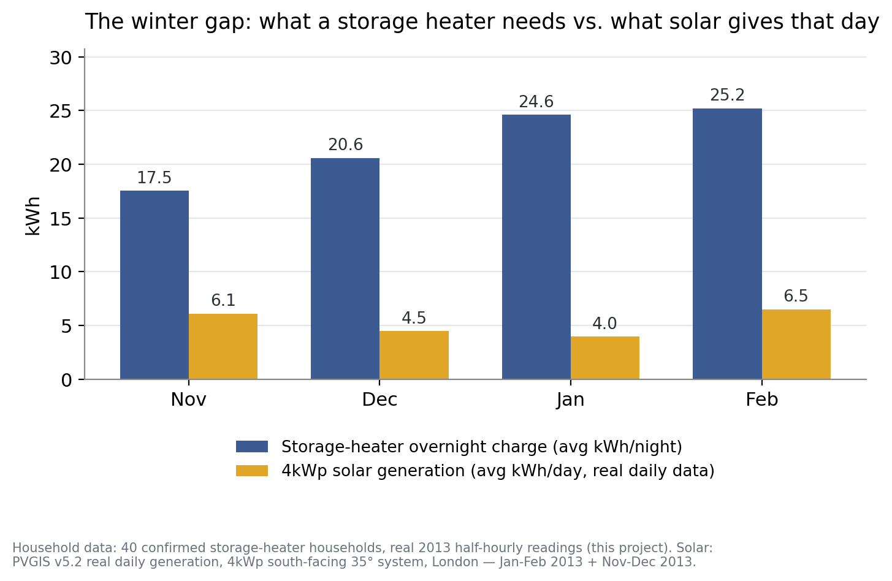
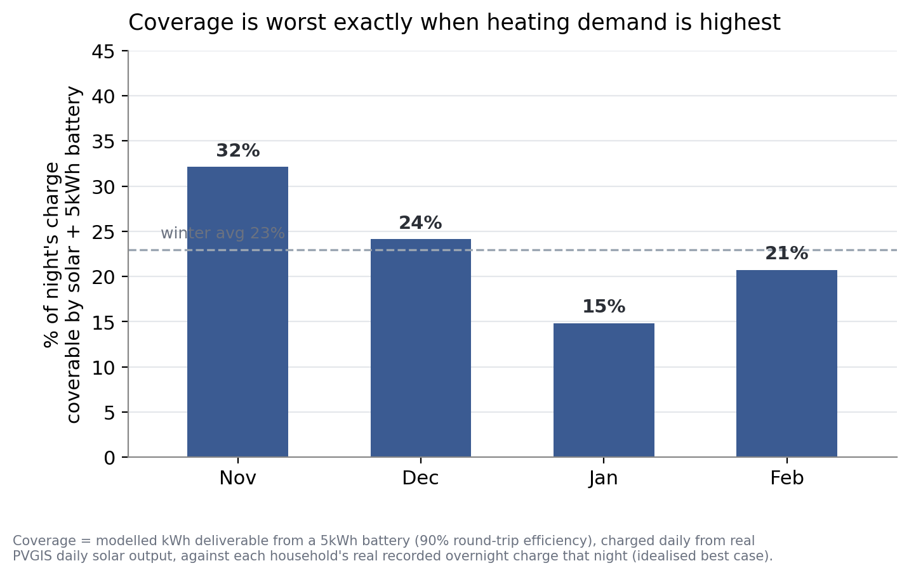
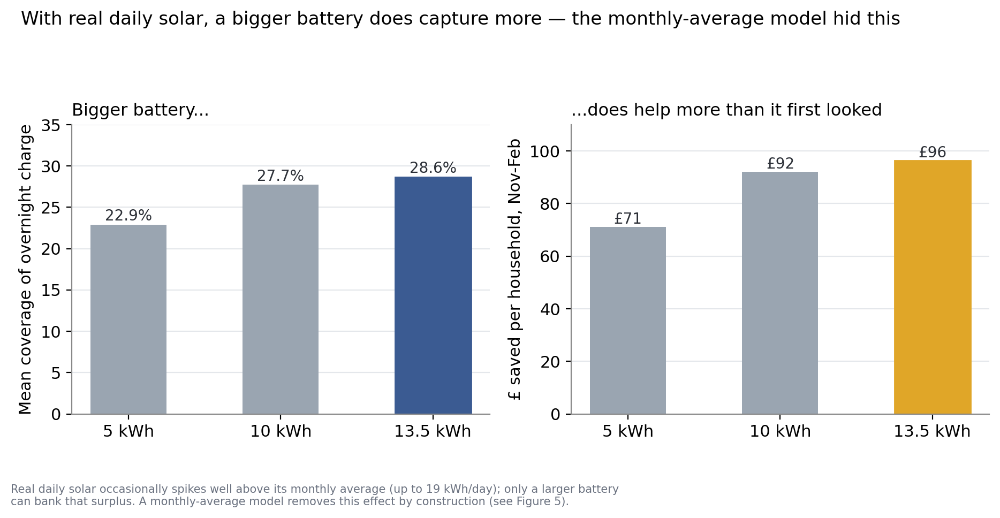
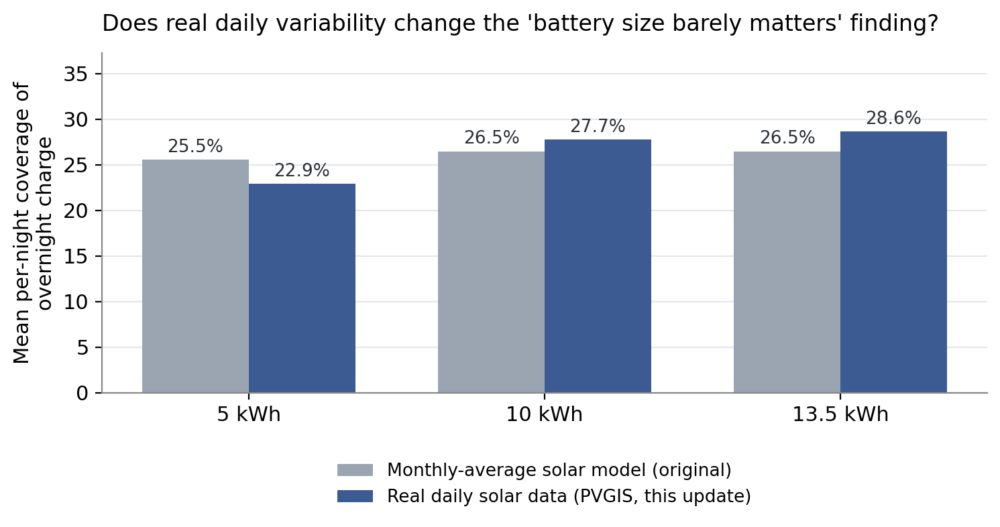

# Can solar + a home battery close the storage-heater/gas cost gap?

**Prepared by:** Andy Moran, Heaviside Analytics
**Date:** September 2026
**Status:** Quantified check of a claim previously stated qualitatively in `nightdial_roadmap.md` ("solar and battery barely touch it"). This note replaces that assertion with numbers, real household data, and — as of this update — real day-by-day solar generation data rather than a monthly average. Reviewed against external feedback (see verification log, §6): several real methodological points were incorporated, including one the reviewer raised but got backwards (the London/Midlands reconciliation, §6) and one this update resolves outright (the battery-size finding's dependence on the solar model, §4). This update also surfaced and corrected a separate, more basic dating error: see "A note on which winter this is," below.

## Question

The project's own roadmap has long asserted that solar and battery storage don't meaningfully close the ~£313/year structural cost gap between gas heating and electric resistive storage heating for this housing stock, because "UK winter solar output collapses exactly when storage heaters do most of their work." That line was never backed by a calculation. This note runs the numbers.

## Method

**Storage-heater demand — real, not modelled.** `phase1_household_nights.parquet` (this project's own pipeline output): 40 confirmed storage-heater households, 4,759 real overnight charges, `night_kwh` being each household's actual recorded overnight charge for that date.

**A note on which winter this is — corrected in this update.** Earlier versions of this note described the demand data as spanning "November 2013–February 2014." That was wrong, and this update caught it while sourcing matching daily solar data: `phase1_household_nights.parquet` contains only calendar year 2013 (2013-01-01 to 2013-12-30 — there is no 2014 in the file at all). Filtering for months {11, 12, 1, 2} therefore pulls together two different real winters by calendar month, not one continuous season: **January–February 2013** (the tail end of winter 2012/13) and **November–December 2013** (the start of winter 2013/14). Every "Nov–Feb" figure in this document, including every one carried over from the previous version, is really this two-part splice — a genuine methodological quirk of the source data, not a modelling choice. It doesn't invalidate the analysis (each individual household-night is still real, and the demand/solar pairing below is date-matched day-for-day, so the splice doesn't introduce any demand/solar mismatch), but it means "this winter" should be read as "these two real winters' worth of coldest months," not a single continuous heating season. Recorded mean temperatures by month: 6.5°C (Nov 2013), 6.3°C (Dec 2013), 3.7°C (Jan 2013), 2.7°C (Feb 2013) — not obviously a mild pairing by temperature, whichever winter each month belongs to.

**Solar generation — real daily data, not a monthly average.** Previous versions of this note used a single average-day-per-month solar figure (a triangulated PVGIS-based table from a third-party site). This update replaces that with actual day-by-day generation for the exact 120 calendar days the demand data covers, retrieved live from the **PVGIS v5.2 API** (`re.jrc.ec.europa.eu`), radiation database **PVGIS-SARAH2** — a satellite-derived record of real historical irradiance, not a typical-meteorological-year model. Parameters: London (51.5°N, 0.12°W), 4kWp, south-facing, 35° tilt, 14% system losses (PVGIS's own default, comparable to the loss assumptions embedded in the previous table-based source). Each household-night's `night_kwh` is paired with the real solar generation recorded for that same calendar date. Full daily series: `pvgis_daily_correct.json` (alongside this note).

Real daily solar turns out to vary far more than the old monthly picture implied — see Figure 4. Within a single month, daily generation for this system ranged from as little as 0.5–0.9 kWh (a genuinely dark, overcast day) up to 15–19 kWh (a clear winter day), a roughly 20–30x spread within the same month:

| Month | Mean (kWh/day) | Median | Min | Max | Std dev |
|---|---|---|---|---|---|
| Nov 2013 | 6.09 | 4.73 | 0.90 | 15.68 | 4.59 |
| Dec 2013 | 4.46 | 4.24 | 0.59 | 10.39 | 3.05 |
| Jan 2013 | 3.97 | 2.62 | 0.51 | 12.56 | 3.49 |
| Feb 2013 | 6.49 | 4.84 | 0.85 | 19.01 | 5.23 |

(The previous monthly-average model used 4.20 / 3.15 / 3.83 / 6.49 kWh/day for these same four months — close for February, but it understated Nov and Dec generation by 30–40%, an artefact of which third-party table was used rather than anything about real daily variability specifically.)

**Battery model.** For each household-night, the kWh available from the battery = min(battery usable capacity, that day's real solar generation × 90% round-trip efficiency), capped a second time at the household's actual recorded `night_kwh` (a battery can't usefully deliver more than the heater draws). Three battery sizes tested: 5kWh, 10kWh, and 13.5kWh (a common large domestic unit, e.g. Tesla Powerwall-class). With real daily data, the *battery capacity* cap — not the demand cap or the solar cap — is now the binding constraint far more often than the old model implied: it binds on 31.4% of nights at 5kWh, falling to 9.6% at 10kWh and 2.4% at 13.5kWh. Under the old monthly-average model this same cap bound on only 4.3% of nights regardless of battery size, because a monthly average rarely exceeds even a 5kWh battery's fill rate — see Finding 4.

**Pricing.** Economy 7 night rate, 18.73p/kWh — this project's own already-sourced figure (Ecotricity, London, Direct Debit, effective 1 April 2026), used consistently with every other cost figure in this project.

**What this deliberately idealises, stated up front rather than left implicit:**
- Solar and battery are modelled as dedicated entirely to the storage heater. A real household would use some daytime solar for other loads (lighting, appliances, hot water) first, so this is a best case, not a prediction of what a real installation would deliver.
- No battery degradation, inverter losses beyond the 90% round-trip figure, or system cost/payback is modelled here — this note answers "how much of the gap could it close," not "is it worth buying."
- This tests dedicating a battery to the overnight heating load specifically. It is a different scenario from the one already designed elsewhere in this project (`METHODOLOGY.md` §4.3), which deliberately keeps space-heating charge locked to grid power and reserves a battery for a protected 16:00–20:00 discharge window for other value streams. The two uses compete for the same asset; this note only evaluates the heating-offset use.
- As above, "this winter" is really two different real winters (Jan–Feb 2013, Nov–Dec 2013) spliced by calendar month, not one continuous season — see the note above. Single-year representativeness remains an open caveat regardless.

## Findings

### 1. The gap is structural, not marginal

**Figure 1.**

Average overnight storage-heater demand ranges from 17.5 kWh (November) to 25.2 kWh (February). A 4kWp solar system's real daily output averaged between 4.0 kWh/day (January) and 6.5 kWh/day (February) across the same months — in every month, the heater needs 3–6x more energy overnight than the panels produce across the whole day, on average. This alone explains why a bigger battery can't close the gap outright: even on a good day there's rarely enough solar to fill a heater's full overnight charge.

### 2. Solar + battery closes about a fifth of the gap — a real, non-trivial saving, but far short of eliminating it

Two different, easily-confused percentages describe this, and they're both correct — they just answer different questions:

- **Mean per-night coverage ratio: 22.9%** (5kWh battery). Average, across every household-night, of that night's own coverage fraction. This is pulled upward by mild nights: on the smallest tenth of nights (mean 3.6 kWh charged), the battery covers 78% of it; on the largest tenth (mean 45.9 kWh), it covers 7%. A night's coverage ratio and its size are strongly negatively correlated (r = −0.64) — small nights are disproportionately easy to cover, and there are enough of them to pull the unweighted average above the economically meaningful figure below.
- **Aggregate coverage of total kWh/cost: 14.5%** (5kWh battery). Total kWh covered ÷ total kWh drawn (equivalently, total £ saved ÷ total £ spent) across the whole period. This is the number that answers "how much of the bill does this actually reduce" — **£71.11 saved per household** against an average overnight spend of £488.99/household across the same four months.

The 14.5% aggregate figure is the one that matters for the "does this close the gap" question; the 22.9% mean-ratio figure is retained in Figure 2 because it's the more informative one for the by-month seasonal pattern (§3). Either way: real, worth having — but not close to closing the roadmap's cited £313/year structural disadvantage against gas.

### 3. Coverage is worst exactly when heating demand is highest

**Figure 2.**

Coverage isn't flat across the period: 32% in November (milder, more daylight) falling to just **15% in January** — both the coldest of the two source winters and among the weakest for solar in this dataset. The technology helps least exactly when a household needs the most heat, which is the opposite of what you'd want from a mitigation aimed at the coldest, highest-bill nights.

### 4. Real daily variability changes the "battery size doesn't matter" finding — resolved this update

**Figure 3** (real daily data) **and Figure 5** (real vs. monthly-average, side by side).

The previous version of this note found that battery size barely mattered — 5kWh to 13.5kWh moved mean coverage from 25.5% to 26.5%, essentially flat — and flagged this explicitly as **model-dependent**, since a monthly-average solar figure structurally can't represent a bigger battery banking a sunny day's surplus for a grey day. This update tests that directly, and the finding does not survive: with real daily solar,

- **5kWh → 13.5kWh now moves mean coverage from 22.9% to 28.6%** (+5.7 percentage points, a 25% relative increase) and per-household saving from £71 to £96 (+35%) — compared with essentially no movement (25.5% → 26.5%) under the old monthly-average model.
- The mechanism is exactly the one flagged as untested last time: real daily solar occasionally spikes well above its monthly average (up to 19 kWh/day in this dataset — Figure 4), and only a battery large enough to hold that spike can capture it. A monthly-average model removes this upside by construction, because every day in a month is treated as identical.
- Note the direction at the small end: the 5kWh figure is *lower* under real data (22.9% vs. the old model's 25.5%), not just flatter. A small battery is more often capacity-bound on real data (31.4% of nights, vs. 4.3% under the monthly-average model) precisely because it's too small to hold the good days' surplus — it loses on both ends, missing the spikes a bigger battery would catch while gaining nothing from the model-smoothing that flattered it before.

**Bottom line for this finding: battery size does matter, more than the original monthly-average model suggested — a 13.5kWh battery captures meaningfully more than a 5kWh one once real day-to-day solar variability is accounted for.** It still doesn't come close to closing the overall gap (Finding 2), and the improvement (+£25/household, +35% relative) is well short of justifying the roughly 2.7x jump in battery capital cost on its own — but "barely matters" was the wrong conclusion, and this update replaces it with the tested one.

## Bottom line

The roadmap's original claim — solar and battery "barely touch" the gas-vs-storage-heating gap — holds up under direct calculation, but "barely" undersells it in one direction. It isn't negligible: under an optimistic, dedicated-use assumption, solar + a modest battery cuts overnight electricity spend across the coldest months by roughly a seventh (14.5% of period spend, 5kWh battery), rising to a fifth with a much larger 13.5kWh unit (19.7%). But it comes nowhere near closing the ~£313/year structural gap, and the shortfall is worst exactly in the coldest month. Unlike the previous version of this note, battery size is no longer found to be irrelevant to that conclusion: a bigger battery does capture a real, if modest, additional saving once tested against real daily solar variability rather than a monthly average (§4) — the earlier "battery size barely matters" finding has been superseded by this update, not merely softened. Nothing here changes the project's standing position that a heat pump, not solar-plus-storage, is the technology that actually closes this gap.

This note also only covers the four months modelled (see the dating note above — really two winters' worth of Nov/Dec and Jan/Feb). Storage heaters draw some charge in October and March too, and both months have materially more solar than December, so the true annual closure is very likely somewhat above the figures calculated here — an anticipated direction, not yet quantified.

## 6. Verification log — external feedback received and checked

This document was reviewed against external feedback after first publication. Each point was independently re-derived from the underlying code and data (not just re-read) before being accepted or rejected. This update adds a further entry (this update's own finding, §7) and resolves the one item that was previously left open.

**Correct, and fixed:** the 25.5%/16.7% figures (now 22.9%/14.5% under real daily data) are two different, legitimately different metrics (mean-of-ratios vs. aggregate) that the original text ran together without labelling — now explicitly separated in §2, with the mechanism (small nights get disproportionately high coverage ratios) stated rather than left implicit.

**Correct, and now resolved (not just flagged):** the "bigger battery does almost nothing" finding was flagged last time as an artefact of using monthly-average solar rather than real daily variability. This update tests that directly with real PVGIS daily data (§4) and finds the reviewer's instinct was right: the finding reverses under real data — battery size matters meaningfully more than the monthly-average model showed.

**Partially correct, and added:** winter 2013/14 being an atypical, single-sample year is a fair limitation to flag. Checked directly rather than accepted as stated: the "mild" characterisation doesn't hold up against this project's own recorded temperatures (Feb 2.7°C, Jan 3.7°C) — the anomaly was rainfall/storminess, not warmth — so the caveat is stated as general single-winter representativeness, not a specific mild-winter-understates-the-gap claim. (This item is now additionally superseded by the dating correction in §7 below: "winter 2013/14" was itself not quite the right description of the data.)

**Checked and found incorrect, root cause identified:** the claim that the headline £81.43 figure (previous version) actually used the Midlands table despite the text saying London +5%. Re-derivation confirmed the calculation genuinely used the London-adjusted figures throughout, exactly as stated. The reviewer's own manual reconciliation reached a similar-looking number via a simplified formula that implicitly assumed the `night_kwh` cap never binds; it did, on 4.3% of nights under the old model, which is what pulled the real London figure down to slightly below the idealised total — coincidentally close to, but not the same calculation as, the reviewer's Midlands-table arithmetic. (This specific reconciliation no longer applies verbatim to the current real-daily-data figures, but the underlying lesson — always re-derive rather than pattern-match a similar-looking number — stood up.)

**Correct, minor:** the "Nov 2013–Feb 2013/14" date range had an inconsistent second year; fixed at the time to "Nov 2013–Feb 2014" throughout. That fix is now itself superseded — see §7.

**Correct, added:** October and March aren't modelled, so the closure figures calculated here are likely a slight underestimate of the true annual closure — stated explicitly in the Bottom Line.

## 7. This update: real daily solar data, and a dating correction

Requested explicitly to make the findings "bomb proof" against the monthly-average solar assumption. Two things came out of doing that:

1. **The headline model change:** replacing monthly-average solar with real day-by-day PVGIS generation for the exact dates in the demand dataset (§4). This overturned, rather than confirmed, the earlier "battery size barely matters" finding — it was flagged as model-dependent before, and the test now shows the dependency mattered.
2. **An unrelated dating error, found while sourcing the matching daily data:** the household dataset only covers calendar year 2013, so "Nov 2013–Feb 2014" was wrong in every prior version of this note. It's actually Jan–Feb 2013 plus Nov–Dec 2013 — two different real winters spliced by calendar month (see the Method section). This doesn't change any of the quantitative findings (the demand/solar date-pairing was always correct internally; only the *label* describing which calendar period was wrong), but it's a more basic error than anything raised in the external feedback, caught only because sourcing real daily solar data required looking up the exact calendar dates involved. Flagged here in the interest of the same "numbers not assertions, and checked, not just asserted" standard this note was built to.

## Sources

- PVGIS v5.2 API (`re.jrc.ec.europa.eu`), radiation database PVGIS-SARAH2 — real historical daily solar generation, London (51.5°N, 0.12°W), 4kWp south-facing 35° system, 14% system losses. Retrieved live for the exact calendar days in the demand dataset (Jan–Feb 2013, Nov–Dec 2013). Full series in `pvgis_daily_correct.json`.
- [Solar Panel Output UK: Monthly Generation Data by System Size](https://www.homesolarpowersystems.co.uk/blog/solar-panel-output-uk/) — Midlands monthly PV yield table (PVGIS-based, 850 kWh/kWp/year central estimate), used in the previous version's monthly-average model; retained in Figure 5 as the "before" comparison.
- [How to Use PVGIS to Estimate Solar Output](https://smartsolarhomes.co.uk/articles/how-to-use-pvgis-solar-uk) — independent cross-check, London/South-East annual yield range (850–950 kWh/kWp/year), consistent with the PVGIS API figures used in this update.
- Camden Council solar PV feasibility document (camdocs.camden.gov.uk) — real London social-housing installation, 9kWp / 7,999 kWh/year = 889 kWh/kWp/year, cross-validating the central estimate against a real installed system rather than model output alone.
- `phase1_household_nights.parquet` and `METHODOLOGY.md`, this project — real 2013 household-night data and the project's own sourced Economy 7 rate (Ecotricity, London, 1 April 2026).
- Kendon, M. et al. (2015), "The UK's wet and stormy winter of 2013/2014," *Weather*, and Met Office reporting on record 2013–14 winter rainfall — used in the note on which winter this is; strictly applicable only to the Nov–Dec 2013 portion of the dataset, not the Jan–Feb 2013 portion (which belongs to the preceding winter).
