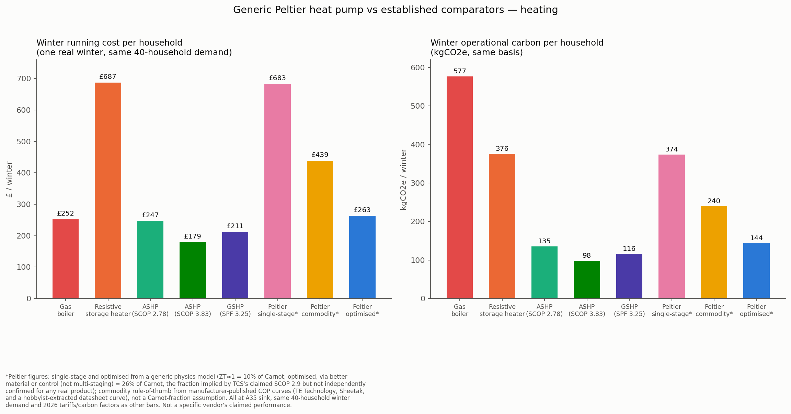
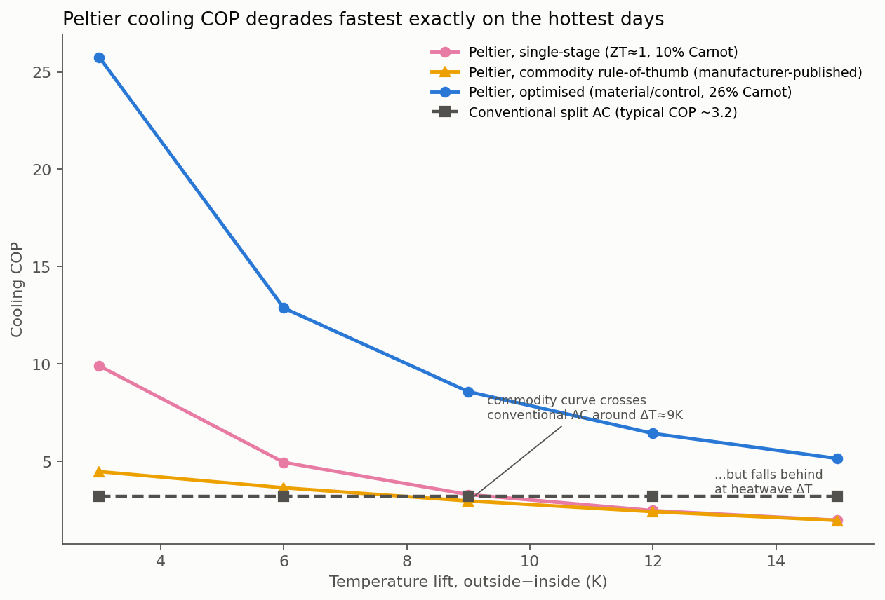

# Generic Peltier (Thermoelectric) Heating and Cooling: A Techno-Economic Assessment

**Prepared by:** Andy Moran, Heaviside Analytics
**Date:** October 2026
**Status:** First-pass techno-economic assessment, generic and vendor-independent (the TCS/Hummingbird-specific analysis is parked separately — see `tcs_thermoelectric_heat_pump_analysis.md`). Runs the same first-principles physics check already applied to TCS's claims against the project's own 40-household real demand dataset, to ask a broader question: independent of any one company's marketing, is Peltier/thermoelectric technology viable for this housing stock's heating and cooling, on the physics and the limited published cost data that exist? **This has reached the limit of what's defensible from public data and modelling alone (see Section 6's note on the heating-COP formula) and is being left here rather than refined further.** A search for a commodity or near-market Chinese manufacturer offering anything comparable to TCS's Hummingbird (a packaged thermoelectric space-heating/cooling product, not a bare module) found nothing — so this assessment tests physics feasibility only, not an existing product category: the technology looks *possible* for this application, but there is currently no "there there" in the market.

## Purpose and scope

This note asks three questions, generically, about Peltier (thermoelectric, solid-state) heat pumps — no refrigerant, no compressor — applied to the same population used throughout this project: (1) what heating performance is physically achievable, at what cost and carbon, against the household population's real winter demand; (2) what cooling performance is achievable, given the same technology's reversibility; (3) what the (thin) published cost evidence says about capital cost, and what's missing. Every figure is tagged **confirmed directly**, **triangulated**, or **modelled/not verified**, per this project's standing discipline.

**A correction carried over from the TCS-specific work, worth stating up front.** That earlier analysis used an Oak Ridge National Laboratory "cascaded thermoelectric heat pump" result (heating COP 2.0–3.6 across −18°C to 8°C ambient) as evidence that cascaded Peltier designs can reach useful COP. Re-reading the source for this assessment found that system is **not** a pure thermoelectric device — it is a conventional two-stage vapor-compression heat pump with a thermoelectric subcooler add-on, confirmed directly from the ACEEE/ORNL paper. That's a meaningful difference: it's evidence a *hybrid* system can reach that COP range, not that a standalone Peltier unit can. This assessment treats that source correctly as hybrid-system evidence and does not reuse it as pure-Peltier performance data. The TCS doc's physics section should be corrected to reflect this the next time it's revisited.

## 1. The physics model used

Every heat pump is bounded by the Carnot limit: COP_Carnot,heating = T_H/(T_H−T_C), with temperatures in Kelvin. Commercial Bi₂Te₃ Peltier modules have a figure of merit ZT ≈ 1 near room temperature, which caps real single-stage thermoelectric COP at roughly 10% of the Carnot value — this is the same relationship already verified against published experimental data in the TCS physics check (ORNL cascaded-hybrid 2.0–3.6; various single-stage/generic Peltier studies clustering at COP 1–4 depending on ΔT; a Samsung paper reporting COP ≈15 at a ΔT of only 1.3°C). This assessment uses two scenarios:

- **Single-stage, ZT≈1 (10% of Carnot)** — representative of an off-the-shelf commercial Peltier module used directly, no architectural enhancement.
- **Optimised, 26% of Carnot (via better material or control, not multi-staging)** — the efficiency fraction implied by TCS's own claimed SCOP of 2.9 at the EN 14825 A7/W35 condition, used here as an upper-bound "if someone achieves this" case, **not** as a confirmed, reproducible figure for any real product. Note on mechanism: this is *not* framed as a cascaded/multi-stage design — true multi-stage cascading generally *reduces* overall COP relative to a single stage, because upper stages must additionally pump away the electrical waste heat dissipated by lower stages; cascading exists to extend the maximum achievable temperature lift beyond a single stage's physical limit (roughly 60–70K no-load), not to improve efficiency. Since UK heating and cooling lifts both fit within a single stage's range, cascading isn't needed here for reach, and wouldn't explain a higher-COP result. A more physically coherent route to 26% of Carnot would be better ZT material or smarter current/voltage control (matching drive current to each ΔT's local optimum) — unconfirmed for TCS or anyone else.
- **Commodity/manufacturer rule-of-thumb** — a third, independently-sourced scenario, grounded not in the Carnot/ZT derivation above but in what real thermoelectric cooler manufacturers and engineers actually publish about single-stage modules in practice. TE Technology's own FAQ states "the COP is typically between 0.3 and 0.7 for single-stage applications"; Sheetak states a COP range of 0.3–0.8 at typical hot-side temperatures; both describe cooling-mode COP without a published curve against ΔT. The one source found with multiple COP-vs-ΔT points was a hobbyist's extraction of a genuinely good single-stage module's datasheet curves (cooling COP ≈5.5 at ΔT≈0, ≈1.4 at ΔT=20K, ≈0.25 at ΔT=40K) — used here as a log-linear interpolated/extrapolated curve, converted to heating COP via COP_heat = COP_cool + 1 (same device, same ΔT, since Q_h = Q_c + electrical input). This curve is a **better-than-bargain** module's data, not an instrumented cheap Chinese commodity chip — so if anything it is optimistic as a stand-in for the cheapest commodity hardware, not pessimistic. It sits as a real-world sanity check alongside the two theory-derived scenarios above, not a replacement for either.

## 2. Heating: applied to the real 40-household winter demand

**Demand data:** the same `phase1_household_nights.parquet` used throughout this project — 40 confirmed storage-heater households, real half-hourly-derived overnight demand, filtered to the same winter months used elsewhere (Nov, Dec, Jan, Feb). Mean household winter heat demand: **2,611 kWh** — this independently reproduces the figure already used in the carbon-comparison LinkedIn post, a useful cross-check that this file and methodology are being read correctly.

**Sink temperature matters enormously, and this is the first real finding.** A modern, well-sized radiator system can run at 35°C flow (the EN 14825 "A7/W35" test standard); a large share of existing UK radiators, sized for a gas boiler, need 45°C or higher to deliver enough heat. Modelled at both:

| Architecture | Sink temp | Mean seasonal COP | Winter cost/household | Winter carbon/household |
|---|---|---|---|---|
| Peltier, single-stage (10% Carnot) | 35°C | **1.01** | £683 | 374 kg |
| Peltier, single-stage (10% Carnot) | 45°C | **0.78** | £878 | 480 kg |
| Peltier, optimised, material/control (26% Carnot) | 35°C | **2.62** | £263 | 144 kg |
| Peltier, optimised, material/control (26% Carnot) | 45°C | **2.04** | £338 | 185 kg |
| Peltier, commodity/manufacturer rule-of-thumb | 35°C | **1.57** | £439 | 240 kg |
| Peltier, commodity/manufacturer rule-of-thumb | 45°C | **1.24** | £553 | 302 kg |

**Reading this honestly.** At the realistic single-stage efficiency a commercial Peltier module actually achieves, heating performance for this housing stock is COP ≈ 0.8–1.0 — *no better than, or literally worse than, plain resistive heating* (a storage heater), because the winter temperature lift this housing stock needs (typically 25–45K from outdoor air to radiator) is large enough that even the Carnot ceiling is modest, and only ~10% of that ceiling is reached by a single-stage ZT≈1 device. This is the direct, quantified version of the physics already laid out in the TCS check: thermoelectric devices are only competitive at *small* temperature lifts, and UK winter space heating is a large-lift application by nature.

The commodity/manufacturer rule-of-thumb scenario lands, as expected, between the two theoretical cases — COP 1.24–1.57 depending on sink temperature, which happens to land close to independent intuition about what a "decent, not special" Peltier module should achieve (COP a bit above 1, more heat delivered than electricity consumed, but modestly). On cost and carbon it clearly beats the resistive storage heater (£439–553 and 240–302 kg, against £687 and 376 kg), which is a genuine, real-world-grounded result, not just a theoretical one. But it still falls well short of any conventional heat pump (£179–247 and 98–135 kg) — commodity Peltier heating would roughly halve a storage heater's carbon, where even a conservative ASHP cuts it by two-thirds to three-quarters.

Even the optimistic "optimised" case (26% of Carnot, via better material or control — unconfirmed for any real product) only reaches COP 2.0–2.6, which is worse than a conservative real-world ASHP (2.78) and far behind a well-installed one (3.83) or GSHP (3.25). **On this project's own numbers, a generic Peltier heat pump does not outperform a conventional heat pump on either cost or carbon for direct ambient-air space heating in this housing stock, under any efficiency assumption that is actually achievable with current commercial thermoelectric materials — commodity or optimised.** The only way a Peltier device looks heating-competitive against conventional heat pumps is to assume a performance level (26% of Carnot) that has not been demonstrated outside one unverified datasheet claim.

## 3. Cooling: where the technology's pitch actually holds up

The physics flips when the temperature lift is small — which is exactly the case for UK summer cooling. Using this project's own generic UK cooling-demand assumption (2.7kW average unit rating, 191 running hours/year, from NESO's FES 2024 workbook figures already confirmed directly in `uk_cooling_demand_grid_peak_load.md` — **515.7 kWh/year/household**), and a representative cooling lift:

| Temperature lift (outside − inside) | Carnot (cooling) | Peltier single-stage COP | Peltier optimised COP (material/control) | Peltier commodity/manufacturer COP | Conventional split AC COP* |
|---|---|---|---|---|---|
| 3K | 99.1 | 9.9 | 25.8 | 4.5 | ~3.2 |
| 6K | 49.5 | 5.0 | 12.9 | 3.7 | ~3.2 |
| 9K | 33.0 | 3.3 | 8.6 | 3.0 | ~3.2 |
| 12K | 24.8 | 2.5 | 6.4 | 2.4 | ~3.2 |
| 15K | 19.8 | 2.0 | 5.2 | 2.0 | ~3.2 |

*\*industry-typical figure for a residential split unit — this was not independently verified against a primary manufacturer/EST source this session and should be treated as a reasonable approximation, not a confirmed figure.*

**This is the genuinely interesting result of this assessment.** At moderate cooling loads (ΔT of 6–9K — a comfortable 24°C indoor target against a 30–33°C outside temperature, a realistic non-heatwave UK summer day), even a single-stage commercial Peltier module beats or matches a conventional split AC on COP, because the lift is small enough that 10% of Carnot is still a respectable number. The optimised (material/control) case is dramatically better across the whole range tested. The commodity/manufacturer rule-of-thumb scenario — the one actually grounded in what real module makers publish, rather than a flat Carnot fraction — tells the same story with a tighter margin: it beats conventional AC at ΔT=3–6K (COP 4.5 and 3.7 against AC's 3.2), lands almost exactly on top of it at ΔT=9K (3.0 vs 3.2), and falls behind from ΔT=12K onward. That crossover point (roughly ΔT=9K) is a more defensible number than the single-stage theoretical curve's implied crossover, because it comes from an actual module's measured performance curve rather than a constant 10%-of-Carnot assumption.

**The caveat is the same pattern this project keeps finding, in a different season.** Cooling COP degrades fastest exactly on the hottest days — the ones cooling is actually needed for. At a genuine heatwave ΔT (15K, e.g. 39°C outside against a 24°C target), single-stage Peltier cooling (COP ≈2.0) falls behind conventional AC, the commodity curve converges to almost the same figure (COP ≈2.0), and even the optimistic optimised case has lost most of its advantage. The technology's best-case scenario and its worst-case scenario are inversely related to when people actually want cooling — structurally the same "works great except when you need it most" problem already documented for storage heaters and solar in this project.

## 4. Capital cost: the evidence is thin, and what exists isn't transferable

No credible, generic, primary-sourced capital cost figure for a *pure* Peltier domestic heating/cooling system was found. What exists:

- **The ORNL hybrid vapor-compression + TE-subcooler system** (Section 1's correction): projected incremental cost of $100–150/kW over a conventional single-speed ASHP, individual TE modules $5–7 each, ~$200–300/ton of TE modules specifically (40 modules in their prototype), and a total system cost increase of roughly 20% over a conventional heat pump, with a modelled 5–10 year payback against vapor-injection cold-climate alternatives. **This cannot be read as "Peltier heating costs 20% more than an ASHP"** — it's a cost premium for *adding* a TE subcooling stage to an already-complete vapor-compression system, not the cost of a standalone thermoelectric heat pump replacing one.
- **An ORNL/A.O. Smith thermoelectric heat pump water heater programme**, targeting a one-year payback against electric resistance water heating — genuinely a pure-TE system, but the full report (behind a paywalled DOI) did not yield COP or cost figures accessible in this research pass.
- **TCS's own Hummingbird/Sunbird**: confirmed (see the parked TCS doc) to have no public pricing at all.
- Generic commercial Peltier modules themselves are commodity-cheap (a few dollars to a few tens of dollars per module depending on rated power), but a space-heating-scale system needs dozens of them plus power electronics, heat exchangers, and controls — the module bill-of-materials is a small fraction of a complete system's likely cost, the same way it is for a conventional heat pump's compressor.

**Net position: there is currently no reliable basis to state a capital cost for a generic domestic Peltier heating/cooling system**, pure or hybrid, that would support a payback calculation against ASHP/GSHP. This is a genuine evidence gap in the published literature, not a gap specific to this project's research effort.

## 5. What this means, held together

The heating case for Peltier/thermoelectric technology in this housing stock is weak on physics grounds, independent of any vendor's claims: UK winter space heating is a large-temperature-lift application, and single-stage commercial thermoelectric modules are fundamentally poorly suited to large lifts. Even an optimistic, currently-unconfirmed "optimised material/control" case doesn't close the gap to a conventional heat pump. This isn't a verification problem (as with TCS specifically) — it's a physics result that holds for the technology category as a whole, using only published ZT values and the Carnot limit.

The cooling case is the opposite, and is worth taking seriously on its own: small temperature lifts are exactly where thermoelectric devices are strong, and UK cooling demand, while growing, is a smaller-lift, shorter-duration, currently under-served application compared to winter heating (consistent with this project's existing cooling-demand work). A Peltier device's "free" reversibility (Section 1 of the TCS doc) may therefore be more valuably framed as a cooling-primary, heating-secondary technology for this housing stock, rather than the heating-primary framing TCS and others market it as — with the significant caveat that cooling performance degrades fastest in exactly the heatwave conditions it would be needed most for.

**Recommended framing if this becomes a LinkedIn post:** not "Peltier heat pumps could heat this housing stock" — the physics doesn't support it, independent of any single company's claims. The more defensible and more interesting framing is: *thermoelectric technology is a plausible cooling solution for a housing stock that mostly has none, and a poor heating solution for a housing stock that desperately needs one* — a genuinely useful, if less flattering for any "universal heat pump replacement" pitch, finding.

**One more honest caveat, found while closing this out.** A search for a commodity or near-market manufacturer (Chinese or otherwise) offering anything comparable to TCS's Hummingbird — a packaged thermoelectric space-heating/cooling product, as opposed to a bare Peltier module sold for electronics cooling — found nothing. So everything in this document is a feasibility test against physics and published component-level data, not a comparison against an existing product category: no one, commodity manufacturer or otherwise, appears to be actually building and selling this at the household-heating scale yet. "Looks physically possible, on paper, using generic components" and "exists as a buildable, costed product" are different claims, and this assessment can only support the first.

## 6. Verification log / items still open

- **Confirmed directly, this session:** the ORNL "cascaded thermoelectric heat pump" (ACEEE/ssb24 paper) is a hybrid vapor-compression system with a TE subcooler, not a pure thermoelectric device — read directly from the paper via WebFetch. This corrects the characterisation carried over from the TCS analysis and should be fixed there too.
- **Confirmed directly, this session:** the 40-household winter demand dataset reproduces the previously-used 2,611 kWh/household figure exactly (mean of `night_kwh` summed over Nov/Dec/Jan/Feb, 2013) — a useful cross-check that this and the earlier carbon-comparison analysis are reading the same underlying data consistently.
- **Confirmed directly, earlier session, reused here unchanged:** DESNZ/Defra 2026 grid carbon factor (0.14395 kgCO2e/kWh consumed basis), gas factor (0.18231 kgCO2e/kWh), Ofgem Oct–Dec 2026 price cap (26.32p electricity / 7.97p gas), real-world boiler efficiency (82.5%), and the ASHP/GSHP SCOP/SPF comparator figures (2.78, 3.83, 3.25).
- **Confirmed directly, this session:** NESO FES 2024 generic UK cooling demand assumption (2.7kW average AC unit rating, 191 running hours/year) — already confirmed directly in `uk_cooling_demand_grid_peak_load.md`; reused here to derive a 515.7 kWh/year/household cooling-output assumption. This is a generic UK average, not measured for this specific 40-household population, which has no metered cooling data (consistent with the wider project finding that UK domestic cooling demand is poorly measured generally).
- **Industry-typical, not independently verified this session:** the conventional split-AC cooling COP of ~3.2 used as a comparator. A direct primary-source figure (manufacturer spec sheet, Energy Saving Trust, or MCS) should replace this before any public-facing use.
- **Not verified / explicitly flagged as a literature gap, not a research shortfall:** no credible capital cost figure exists for a pure Peltier domestic heating/cooling system. The ORNL hybrid-system cost data (Section 4) is the closest available evidence and is explicitly not transferable to a standalone-Peltier cost case.
- **Modelled, not measured:** all Peltier COP, cost, and carbon figures in this document are derived from a first-principles Carnot/ZT model, not from any vendor's measured field data or this project's own bench testing. The single-stage (10% Carnot) scenario is grounded in published experimental ranges; the "optimised, 26% Carnot" scenario is explicitly an upper-bound "if achieved" case — reached via better ZT material or control, not multi-staging — not a demonstrated result. (Multi-stage cascading was initially used as this scenario's label; that was corrected, since true cascading generally reduces COP rather than improving it — see Section 1.)
- **Confirmed directly, this session:** two independent commercial thermoelectric-cooler manufacturers (TE Technology and Sheetak) publish a COP band of 0.3–0.8 for single-stage cooling applications, read directly from their own FAQ/technical pages via WebFetch. This is the primary-source basis for the "commodity/manufacturer rule-of-thumb" scenario added to Sections 1–3.
- **Triangulated, this session:** the ΔT-resolved commodity curve (cooling COP 5.5 / 1.4 / 0.25 at ΔT 0 / 20 / 40K) comes from one hobbyist's extraction of a single high-performance module's published datasheet curves, not a primary manufacturer source and not an instrumented measurement of a genuinely cheap commodity chip. It is used as the best available *shape* for COP-vs-ΔT, consistent with but not identical to the flat 0.3–0.8 band the two manufacturer FAQs state without a ΔT curve. Treat the commodity scenario's numbers as indicative, not as a verified commodity-module measurement.
- **Open methodological note:** the sink-temperature sensitivity (35°C vs 45°C) materially changes the heating result across all three scenarios (e.g. commodity COP 1.57 vs 1.24) — a real retrofit assessment for any specific property would need to know its actual radiator sizing/flow-temperature requirement rather than assuming either value generically.
- **Known limitation, found this session and deliberately left unresolved: the single-stage/optimised heating-COP formula is not internally consistent with the commodity scenario, and fixing it doesn't produce a clean answer.** Heating COP for any two-reservoir heat pump is bounded by the identity COP_heat = COP_cool + 1 (every electrical watt in ends up as heat somewhere, so heating can never be worse than 1-for-1 resistive heating in an idealised accounting). The single-stage and optimised scenarios were built by applying their Carnot fraction (10%/26%) directly to the *heating* Carnot ratio, which does not route through that identity — at this housing stock's realistic 45°C-sink ΔT, that produces a single-stage heating COP of 0.78, i.e. below 1, which the identity says shouldn't happen for an ideal device. The commodity scenario *was* built via the identity (cooling COP from the manufacturer curve, then +1), so the two methodologies aren't on the same footing. Recomputing the single-stage/optimised scenarios the "correct" way (fraction applied to the Carnot *cooling* ratio, then +1) raises them substantially — single-stage to COP 1.69–1.91, optimised to COP 2.78–3.36 — and in doing so flips the ranking: the "corrected" generic physics floor then sits *above* the commodity manufacturer figure (1.24–1.57), which is the opposite of the intuitive ordering (commodity-as-floor, optimised-as-ceiling) this document otherwise uses. Different legitimate ways of doing the same calculation don't agree on the ranking, which is a sign that the useful output here is a **range** (roughly COP 1.0–1.9 for realistic single-stage Peltier heating at this ΔT, bounded below by the COP≥1 identity), not three precisely-ranked point estimates. The tables, charts, and discussion above are left as originally built rather than re-derived, because re-deriving them further would trade a known, flagged limitation for a false sense of added precision — the identity-corrected numbers are noted here for the record rather than substituted in.
